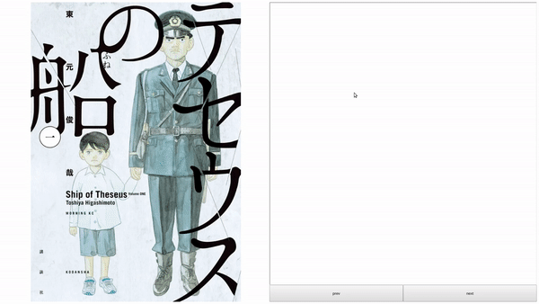

# mangaviewer
A web app that displays images together with a Japanese dictionary.

It looks roughly like this:

# setup
This is just a proof-of-concept so far and still work in progress.
But if you want to play with it, you will need to
* set up a Google Cloud Vision service account by following [these docs](https://cloud.google.com/vision/docs/setup)
* install the vision nodejs library via `npm install `npm install --save @google-cloud/vision`
* drop your manga in a folder under manga. The filenames need to be in order according to [https://developer.mozilla.org/en-US/docs/Web/JavaScript/Reference/Global_Objects/Array/sort](Array.prototype.sort) for now
